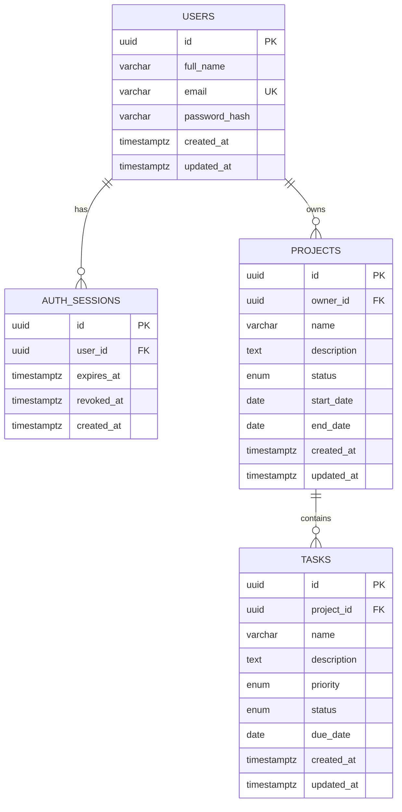

# PostgreSQL schema

The initial migration is `1791468000000-InitialSchema.ts`. TypeORM maps camelCase properties to snake_case columns. Synchronization and automatic migration execution are disabled.

UUID keys use PostgreSQL 16's native `gen_random_uuid()` without extension installation. Email is unique and constrained to trimmed lowercase form. Full names/project names/task names are nonblank. A bcrypt-format constraint protects password storage. Foreign keys cascade on parent deletion, preventing orphan rows. Task ownership is derived through its project, avoiding redundant user IDs.

Descriptions are nullable and capped at 10000 characters. Optional scheduling dates are SQL dates; creation/update/session timestamps include time zones. Project date ordering is constrained. Sessions require expiry after creation and store revocation state without storing raw JWTs.

| Enum | Values |
| --- | --- |
| `project_status_enum` | `NOT_STARTED`, `IN_PROGRESS`, `COMPLETED` |
| `task_status_enum` | `PENDING`, `IN_PROGRESS`, `COMPLETED` |
| `task_priority_enum` | `LOW`, `MEDIUM`, `HIGH` |

Primary-key/unique-email indexes are automatic. Additional indexes cover `auth_sessions(user_id, expires_at)`, `projects(owner_id, status)`, `projects(owner_id, created_at)`, `tasks(project_id, status, priority)`.

Run `npm run migration:show` and `npm run migration:run` from `backend/`. The migration is transactional and repeat runs apply only pending changes. TypeORM maintains its own migrations table. Source and compiled runners share connection options. Future entity changes should be accompanied by reviewed versioned migrations.

Reverting the initial migration drops its tables/enums and destroys their data. The integration suite verifies rollback/reapplication only in a uniquely named disposable database, preserving the configured database. It also checks that entity metadata matches the migrated schema.
